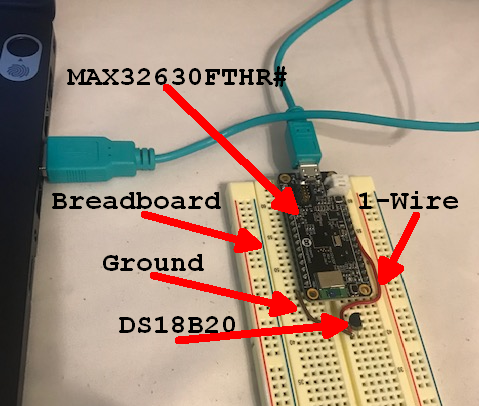
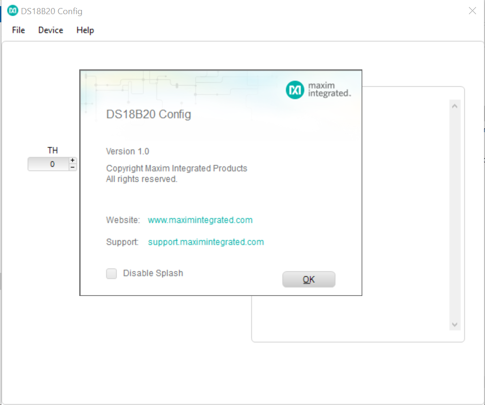
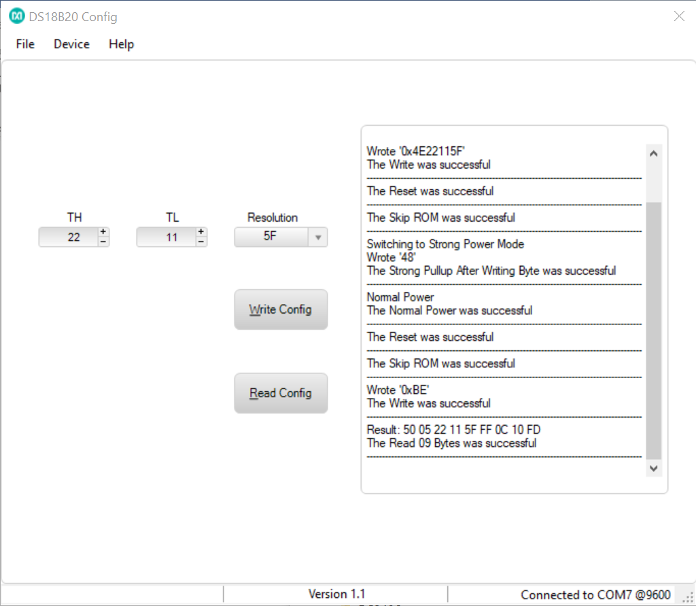

# DS18B20_Config
The DS18B20_Config program is meant to help a user understand the sequence of 1-Wire commands to read and write the part's alarm and configuration registers. The GUI connects through a USB cable to a MAX32630FTHR (FTHR) board which has the “Raw 1-Wire Interface” firmware loaded on it. If the customer has an unprogrammed MAX32630FTHR, he/she will need to load the firmware before running the GUI. 

It offers 3 input fields for the high alarm, low alarm and resolution.  It also contains a "Write Config" button, a "Read Config" button, and an output text box. To use: the user inputs the configuration bytes in the appropriate input fields and clicks the "Write Config" button to write the configuration to the part.  The output of each 1-Wire command step is output to the textbox. To read, the user simply clicks the "Read Config" button and each 1-Wire step is similarly output to the text box.

**Hardware Setup**:
- MAX32630FTHR# board with FTHR pin headers soldered on for breadboard connectivity.
- Breadboard.
- Breadboard wires to bring out the 1-Wire Master (OWM) line and a ground line.  See the MAX32630FTHR pinout on [this page](https://os.mbed.com/platforms/MAX32630FTHR/) to locate the OWM and ground pins.
- DS18B20 in TO-92 package (plugs directly into a breadboard). See Figure 1 below. Obtain multiple devices for experimentation.
- USB – mini cable connects the MAX32630FTHR# to a PC’s spare USB port for power and serial communication.
- MAX32625PICO# (PICO) is required to program firmware on the FTHR board. This comes with the FTHR board, a separate USB cable to power the PICO, and a 10-pin SWD ribbon cable for programming the FTHR that connects the PICO and FTHR together. (The PICO setup is not shown in Figure 1 below).

  
Figure 1. Hardware Setup

**Getting Started**
- Click the "Clone or Download" button and click "Download ZIP" from the [main GITHUB repo page](https://github.com/MaximIntegratedTechSupport/DS18B20_MAX32630FTHR). After the download finishes, unzip the files to a directory of your choosing. Each program comes with its own installation program and can be found in their respective ".\publish" directories.  To install a program double-click on the setup.exe program found in the .\publish directory and follow the prompts.
- Upon running the GUI program, the Maxim Splash Screen will be the first thing to appear. See Figure 2.
- After 3 seconds, the Maxim Splash Screen will disappear and the 'Connect to Serial Port' screen will appear. This screen is where the customer connects the serial port to the FTHR.
- The list of COM ports get pre-populated before the connection screen appearing.  Press the 'Refresh List' button to refresh the list of COM ports (when applicable). Select the COM port that the FTHR is connected to and press the 'Connect' button. See Figure 3.
- Once connected to a Serial port, the Main Program will appear and display the COM port and Baud rate, as well as the firmware version at the bottom of the main window. See screenshot below in Figure 2.
- Writing Configuration Info: The main window displays 2 numeric up/down input boxes to input the threshold high (TH) and threshold low (TL) configuration bytes. They shall only be able to accept hexadecimal characters.  The third configuration byte shall be represented by a drop-down box and only allow the following 4 selections from which to choose:  1F, 3F, 5F, and 7F.  After filling in these fields, the user should click the Write Config button.  The main output text box to the right will display all commands sent and all the data coming back from the FTHR board’s firmware. The programmer shall follow the DS18B20 Operation Example 2 found on page 18 of the DS18B20’s data sheet (except for reading back the scratchpad and calculating the CRC):  https://datasheets.maximintegrated.com/en/ds/DS18B20.pdf
- Reading Configuration Info:  To read, the user should simply click the Read Config button. The bytes read will display in the main output text box which will get populated with fail or success messages after each 1-Wire step completed. The program follows a subset of the DS18B20 operation Example 2 mentioned above (no CRC calculation is necessary).

Figure 2. Splash Screen

  
Figure 3. Serial Port Connection Screen

Figure 4. Main GUI Window.