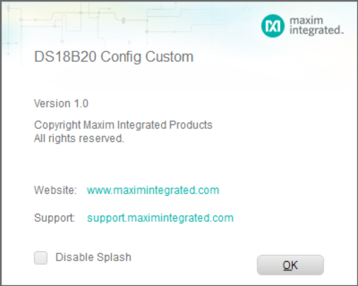
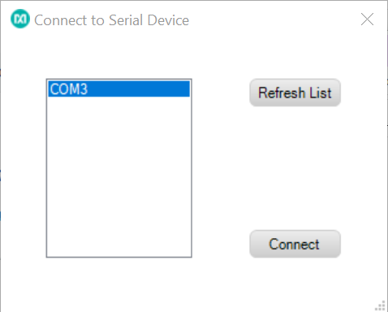
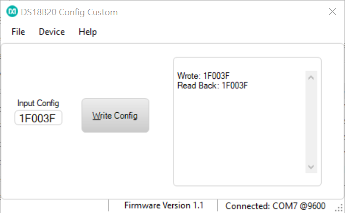

# DS18B20_Custom
The DS18B20_Custom program is meant to be used as a small-volume DS18B20 programmer -- specifically to write the part's alarm and configuration registers. The GUI connects through a USB cable to a MAX32630FTHR (FTHR) board which has the “Raw 1-Wire Interface” firmware loaded on it. If the customer has an unprogrammed MAX32630FTHR, he/she will need to load the firmware before running the GUI. 

**Hardware Setup**:
- MAX32630FTHR# board with FTHR pin headers soldered on for breadboard connectivity.
- Breadboard.
- Breadboard wires to bring out the 1-Wire Master (OWM) line and a ground line.  See the MAX32630FTHR pinout on [this page](https://os.mbed.com/platforms/MAX32630FTHR/) to locate the OWM and ground pins.
- DS18B20 in TO-92 package (plugs directly into a breadboard). See Figure 1 below. Obtain multiple devices for experimentation.
- USB – mini cable connects the MAX32630FTHR# to a PC’s spare USB port for power and serial communication.
- MAX32625PICO# (PICO) is required to program firmware on the FTHR board. This comes with the FTHR board, a separate USB cable to power the PICO, and a 10-pin SWD ribbon cable for programming the FTHR that connects the PICO and FTHR together. (The PICO setup is not shown in Figure 1 below).

  
Figure 1. Hardware Setup

**Getting Started**
- Click the "Clone or Download" button and click "Download ZIP" from the [main GITHUB repo page](https://github.com/MaximIntegratedTechSupport/DS18B20_MAX32630FTHR). After the download finishes, unzip the files to a directory of your choosing. Each program comes with its own installation program and can be found in their respective ".\publish" directories.  To install a program double-click on the setup.exe program found in the .\publish directory and follow the prompts.
- Upon running the GUI program, the Maxim Splash Screen will be the first thing to appear. See Figure 2.
- After 3 seconds, the Maxim Splash Screen will disappear and the 'Connect to Serial Port' screen will appear. This screen is where the customer connects the serial port to the FTHR.
- The list of COM ports gets pre-populated before the connection screen appears.  Press the 'Refresh List' button to refresh the list of COM ports (when applicable). Select the COM port that the FTHR is connected to and click the 'Connect' button. See Figure 3.
- Once connected to a Serial port, the Main Program will appear and display the COM port and Baud rate, as well as the firmware version at the bottom of the main window. See screenshot below in Figure 4.
- Writing Configuration Info: The main window displays a single input text box to hold 3 bytes in hexadecimal format (no spaces): the threshold high alarm (TH), the threshold low (TL) alarm, and the resolution. After filling in the text box, the user should click the Write Config button. This writes the three bytes to the DS18B20 and performs a read back so the user can confirm the bytes actually got written. This follows a subset of the DS18B20 Operation Example 2 on page 18 of the [DS18B20’s data sheet](https://www.maximintegrated.com/en/products/sensors/DS18B20.html) (without calculating the CRC).  The main output text box to the right will display what got written to the part and what got read back (see Figure 4).

Figure 2. Splash Screen

  
Figure 3. Serial Port Connection Screen

Figure 4. Main GUI Window.